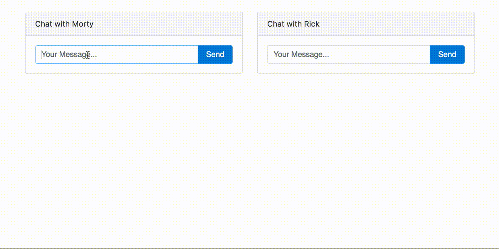

# Unread Messages Example Application



## How to run

Service the root directory with a static file server

### Python

```sh
python -m SimpleHTTPServer &
```

### Node

Install ```http-server```

```sh
npm install http-server -g
```

Run ```http-server``` in the example directory

```sh
http-server
```